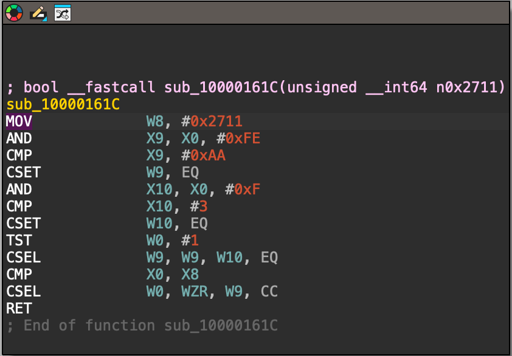
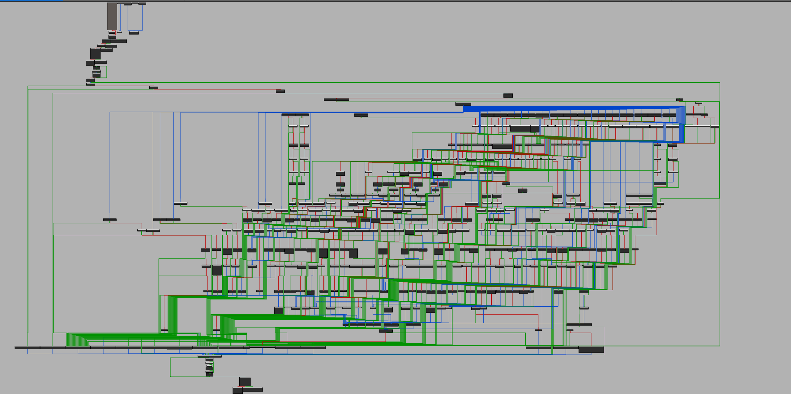
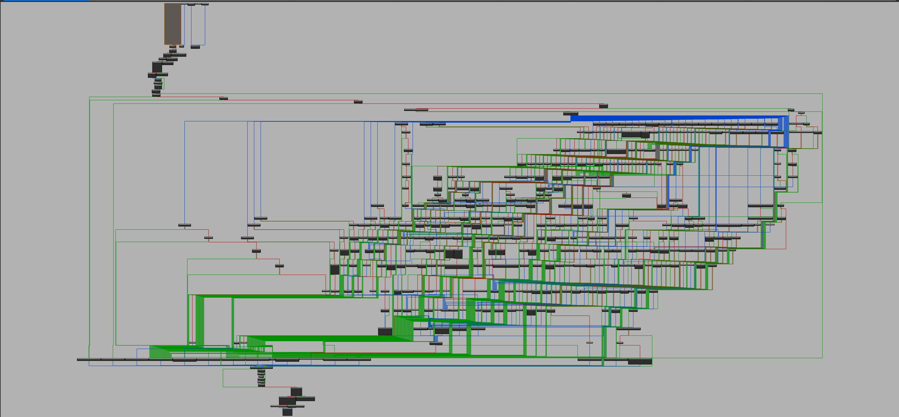

# 🛡️ RustAegis

> **Next-Generation Virtualization & Obfuscation Framework for Rust**

[](https://crates.io/crates/aegis_vm)
[](https://docs.rs/aegis_vm)
[](https://opensource.org/licenses/MIT)

RustAegis is a research-grade software protection system that compiles Rust code into custom, polymorphic virtual machine bytecode. It is designed to protect sensitive logic against reverse engineering and tampering by moving execution from the native CPU to a secure, randomized software interpreter.

## 🚀 Key Features

*   **Virtualization:** Converts Rust AST directly into a custom stack-based VM instruction set with 100+ opcodes.
*   **Native Function Calls:** External functions called inside `#[vm_protect]` are automatically wrapped and executed. No manual setup required.
*   **Rich Type Support:** Strings, Vectors/Arrays, integers (signed/unsigned), booleans with proper type tracking.
*   **Heap Memory:** Dynamic memory allocation with automatic cleanup on scope exit.
*   **Variable Shadowing:** Full Rust-like scoping with nested block support.
*   **Polymorphism:** The instruction set mapping (Opcode Table) is randomized for every build via a `.build_seed` artifact.
*   **Mixed Boolean-Arithmetic (MBA):** Transforms simple arithmetic (`+`, `-`, `^`) into complex, mathematically equivalent boolean expressions.
*   **Compile-Time Encryption:** Bytecode is encrypted with a unique key per build and decrypted only at runtime.
*   **White-Box Cryptography (WBC):** AES key derivation uses Chow et al. (2002) scheme - keys are never exposed in memory.
*   **Anti-Tamper:** Integrated integrity checks ensure the bytecode has not been modified.
*   **Junk Code Injection:** Inserts dead code and entropy-based instructions to break signature scanning.
*   **WASM Support:** Full WebAssembly compatibility for browser and Node.js environments.

## 📦 Installation

Add the following to your `Cargo.toml`:

```toml
[dependencies]
aegis_vm = "0.2.5"
```

## 🛠️ Usage

Apply the `#[vm_protect]` attribute to any sensitive function you wish to virtualize.

```rust
use aegis_vm::vm_protect;

// Standard protection (Polymorphism + Encryption)
#[vm_protect]
fn check_password(input: u64) -> bool {
    input == 0xCAFEBABE
}

// Paranoid protection (Heavy MBA + Obfuscation)
// Use this for critical logic like key derivation.
#[vm_protect(level = "paranoid")]
fn derive_key(seed: u64) -> u64 {
    // All arithmetic here is transformed into complex boolean logic
    (seed ^ 0x1234) + 0xABCD
}

// Advanced: Strings, Arrays, and Control Flow
#[vm_protect(level = "standard")]
fn compute_checksum() -> u64 {
    let secret = "LICENSE-KEY";
    let weights = [1, 2, 3, 4, 5];

    // String length check
    if secret.is_empty() {
        return 0;
    }

    // Array iteration with weighted sum
    let mut sum: u64 = 0;
    for i in 0..weights.len() {
        sum += weights.get(i) * (i as u64 + 1);
    }

    // Combine with string hash
    sum + secret.len()
}

// NEW in v0.2.2: Native Function Calls
fn is_license_valid() -> bool {
    // External license check logic
    true
}

fn log_event(code: u64) {
    println!("Event: {}", code);
}

#[vm_protect]
fn check_authorization() -> bool {
    // External functions are automatically wrapped!
    let valid: bool = is_license_valid();  // Note: explicit bool type

    if !valid {
        log_event(1);  // Native call works
        return false;
    }

    log_event(0);
    true
}
```

## ⚙️ Architecture & The `.build_seed`

RustAegis uses a split architecture:
1.  **Compiler (`vm-macro`):** Runs at compile time, generating encrypted bytecode.
2.  **Runtime (`vm`):** Runs inside your application, executing the bytecode.

### Synchronization via `.anticheat_build_seed`
To ensure the compiler uses the exact same encryption keys and opcode mapping that the runtime expects, the system generates a temporary artifact named `.anticheat_build_seed` in your project root during the build process.

*   **Local Development:** This happens automatically. If you encounter a "Build ID mismatch" error, simply run `cargo clean` to regenerate the seed.
*   **CI/CD:** The seed is unique to each build environment. Do **not** commit `.anticheat_build_seed` to version control if you want unique polymorphism for every deployment.
*   **Reproducible Builds:** If you need exactly the same VM bytecode across different machines, you can set the `ANTICHEAT_BUILD_KEY` environment variable. This overrides the random generation.

```bash
# For reproducible builds (same opcodes, same keys)
export ANTICHEAT_BUILD_KEY="my-secret-company-build-key"
cargo build --release
```

## 🔍 Analysis & Reverse Engineering

RustAegis significantly complicates static and dynamic analysis by flattening control flow and obfuscating data flow.

### Indirect Threading Dispatch

The VM uses indirect threading (function pointer table) instead of a traditional switch-case dispatcher. This eliminates recognizable patterns in binary analysis:

**Traditional Switch-Case:**
```asm
cmp x8, #0x01      ; Compare opcode
b.eq handler_push  ; Branch to handler
cmp x8, #0x02
b.eq handler_pop
...
```

**Indirect Threading (RustAegis):**
```asm
ldrb w8, [decode_table, opcode]   ; Decode shuffled opcode
ldr  x9, [handler_table, x8, lsl#3] ; Load handler pointer
blr  x9                            ; Indirect call
```

This approach:
- Eliminates ~10KB switch-case pattern → ~800 bytes dispatcher
- No sequential CMP/branch patterns visible in IDA/Ghidra
- Handler functions distributed across binary
- Opcode mapping hidden in runtime table lookup

### Control Flow Flattening

The original control flow (if/else, loops) is flattened into data-driven jumps within the interpreter loop.

**Native CFG:**
Distinct blocks for `if`, `else`, and `return`, easily readable by decompilers.


*Figure 1: Native assembly of the license check function. Logic is linear and easy to follow.*

**VM CFG:**
A single "God Node" (the dispatcher) with edges pointing back to itself. The actual logic is hidden in the bytecode data, not the CPU instructions.


*Figure 2: The same function protected by the VM. The control flow is flattened into the VM's fetch-decode-execute loop.*

### Arithmetic Obfuscation (MBA)

Instead of a single `ADD` instruction, the analyst sees a randomized sequence of stack operations implementing mathematically equivalent formulas like:
`x + y = (x ^ y) + 2 * (x & y)` or `(x | y) + (x & y)`


*Figure 3: Even a simple arithmetic function explodes into a complex graph due to MBA transformations and the VM dispatcher overhead.*

## ⚡ Performance & Constraints

Virtualization comes with a cost. RustAegis is designed for **security**, not speed.

*   **Performance:** Expect a 10x-100x slowdown compared to native code. This is standard for software-based virtualization.
*   **Usage:** Apply `#[vm_protect]` **only** to sensitive functions (license checks, key generation, encryption logic). Do **not** virtualize tight loops in performance-critical rendering or physics code.
*   **Supported Platforms:** Works on `x86_64`, `aarch64`, `wasm32`, and any platform supported by Rust `std` or `alloc` (no_std compatible).

## 📂 Examples

Check the `examples/` directory for complete test cases:

*   `001_test.rs`: Native function call support demo.
*   `01_arithmetic.rs`: Demonstrates MBA transformations.
*   `02_control_flow.rs`: Demonstrates if/else logic protection.
*   `03_loops.rs`: Demonstrates loop virtualization.
*   `04_wasm.rs`: Demonstrates WASM integration.
*   `05_whitebox_crypto.rs`: Demonstrates White-Box Cryptography key protection.
*   `06_native_calls.rs`: Manual NativeRegistry usage (legacy).
*   `07_native_call_macro.rs`: Automatic native call via macro.
*   `08_async_vm.rs`: **NEW** - Async VM with state machine obfuscation (experimental).
*   `wasm_test/`: Complete WASM test project with `wasm-pack`.

Run them with:
```bash
cargo run --example 001_test
cargo run --example 01_arithmetic
cargo run --example 07_native_call_macro
cargo run --example 08_async_vm --features async_vm

# For WASM tests
cd examples/wasm_test
wasm-pack test --node
```

## 🌐 WASM Support

RustAegis fully supports WebAssembly. To use with WASM:

### Setup
```bash
# Add WASM target
rustup target add wasm32-unknown-unknown

# Install wasm-pack (optional, for building/testing)
cargo install wasm-pack
```

### Cargo.toml Configuration
```toml
[dependencies]
aegis_vm = { version = "0.2.5", default-features = false }
wasm-bindgen = "0.2"
```

### Usage Pattern
Since `#[vm_protect]` and `#[wasm_bindgen]` cannot be combined directly, use a wrapper:

```rust
use aegis_vm::vm_protect;
use wasm_bindgen::prelude::*;

// VM-protected implementation
#[vm_protect(level = "debug")]
fn secret_impl(x: u64) -> u64 {
    x ^ 0xDEADBEEF
}

// WASM export wrapper
#[wasm_bindgen]
pub fn secret(x: u64) -> u64 {
    secret_impl(x)
}
```

### Building WASM
```bash
cd examples/wasm_test

# Build for web
wasm-pack build --target web --release

# Run tests with Node.js
wasm-pack test --node

# Run tests in headless browser
wasm-pack test --headless --firefox
```

The compiled `.wasm` file will be in `pkg/` directory.

## 🧪 Experimental Features

### Async VM Engine (`async_vm`)

> **Status:** Experimental - Use for testing and research only

The Async VM feature transforms the VM execution loop into an async/await state machine, adding an extra layer of obfuscation against reverse engineering.

**How it works:**
- Rust compiler transforms `async fn` into a complex state machine enum
- Debuggers stepping through code see executor transitions instead of direct logic
- Yield points inject state transitions at configurable intervals

**Enable:**
```toml
[dependencies]
aegis_vm = { version = "0.2.5", features = ["async_vm"] }
```

**Usage:**
```rust
use aegis_vm::async_vm::execute_async;

// Same as execute(), but uses async state machine internally
let result = execute_async(&bytecode, &input)?;
```

**Trade-offs:**
| Aspect | Impact |
|--------|--------|
| Binary size | +5-10KB (state machine code) |
| Performance | ~2-5% overhead (yield points) |
| Analysis difficulty | Harder to trace in debuggers |

**Note:** This is an obfuscation layer, not cryptographic security. A skilled analyst can still reverse the state machine given enough time.

## 📋 Changelog

### v0.2.5

**Bug Fixes (GitHub Issue #1):**
*   **Missing `spin` Dependency:** The proc-macro generates `spin::Once` for `no_std` caching, but `spin` was not listed as a dependency. Fixed by adding `spin = "0.9"` to dependencies.
*   **cfg Warning Fix:** Removed `#[cfg(feature = "std")]` from generated code that caused "unexpected cfg condition value" warnings. Now always uses `spin::Once` for bytecode caching (works for both std and no_std).

### v0.2.3

**Async VM Engine (Experimental):**
*   **State Machine Obfuscation:** New `async_vm` feature transforms VM dispatch loop into async/await state machine, complicating control flow analysis in debuggers.
*   **Custom Micro-Executor:** Zero-dependency `block_on` implementation (~60 lines) with `no_std` support.
*   **Polymorphic Yield Mask:** `YIELD_MASK` constant derived from build seed - yield frequency varies per-build (64-256 instruction intervals).
*   **Battery-Friendly:** Uses `std::thread::yield_now()` or `core::hint::spin_loop()` instead of busy-spin.

**New Module Structure:**
```
src/async_vm/
├── mod.rs        # Module exports
├── executor.rs   # block_on + noop_waker
├── yielder.rs    # YieldNow future
└── engine.rs     # Async run loop
```

**API:**
*   `execute_async(code, input)` - Async version of `execute()`
*   `execute_async_with_natives(code, input, registry)` - With native function support
*   `VmState::get_yield_mask()` / `set_yield_mask()` - Runtime yield configuration

**CI/CD:**
*   Added `async_vm` job to GitHub Actions workflow

### v0.2.2

**Native Function Call Support:**
*   **Automatic External Function Calls:** Functions called inside `#[vm_protect]` are now automatically wrapped and executed via native call mechanism. No manual `NativeRegistry` setup required.
*   **Function Table Pattern:** Macro generates wrapper functions (`fn(&[u64]) -> u64`) and creates a native function table at compile-time.
*   **`NATIVE_CALL` Opcode:** New opcode `0xF0 <index> <arg_count>` for calling external functions from VM bytecode.
*   **`execute_with_native_table()`:** New engine function that accepts a native function table for macro-generated code.

**Boolean NOT Fix:**
*   **Logical NOT for Booleans:** Fixed `!bool` operator to use XOR instead of bitwise NOT. Previously `!true` would return `0xFFFFFFFFFFFFFFFE` (truthy), now correctly returns `0` (false).
*   **Type Detection:** Added `is_bool_expr()` to detect boolean expressions and apply correct NOT semantics.

**Improved Error Messages:**
*   **Macro Call Detection:** Rust macros (`println!`, `log::error!`, etc.) now produce clear error: `"Macro calls not supported in VM: println!(...). Use a native function wrapper instead."`
*   **Region Check Fix:** Fixed `decrypted` → `bytecode` variable name in paranoid mode region integrity check.

**New Example:**
*   `examples/001_test.rs`: Demonstrates native call support with VM-protected functions calling external functions.

**Important Notes:**
*   Use explicit type annotations for bool returns from function calls: `let result: bool = some_function();`
*   Supported argument/return types: `u64`, `u32`, `i64`, `i32`, `u16`, `u8`, `bool`, `char`

### v0.2.1

**Security Hardening:**
*   **Indirect Threading Dispatch:** Replaced traditional switch-case dispatcher with function pointer table lookup. This eliminates recognizable VM patterns in binary analysis - dispatcher reduced from ~10KB to ~800 bytes.
*   **String Obfuscation:** All error messages and internal strings are now encrypted at compile-time using `aegis_str!` macro. Strings are decrypted only when accessed at runtime.
*   **Panic-Free Proc-Macro:** Removed all panic messages from proc-macro that could leak implementation details. Errors now use generic codes (E01-E05).
*   **Demo String Removal:** Removed 1KB+ demo/documentation strings that exposed WBC implementation details.

**Architecture Improvements:**
*   **Handler Module Reorganization:** All 87 opcode handlers moved to dedicated `handlers/` directory with category-based modules (stack, arithmetic, control, memory, etc.).
*   **Unified Handler Type:** All handlers now use `fn(&mut VmState, &NativeRegistry) -> VmResult<()>` signature for consistent dispatch.
*   **Const Handler Table:** Handler table is `const` (not `static`) for no_std/WASM compatibility.

**Binary Analysis Results:**
| Metric | Before | After |
|--------|--------|-------|
| Dispatcher Size | ~10KB | ~800 bytes |
| Pattern Visibility | CMP/branch chains | Single indirect call |
| String Exposure | Plaintext errors | Encrypted at rest |

### v0.1.52

**Pattern Matching Engine:**
*   **Full Match Expression Support:** Comprehensive `match` expression compilation with 45 dedicated tests.
*   **Pattern Types Supported:**
    *   Literal patterns: `1`, `42`, `"hello"`
    *   Variable bindings: `n`, `x`
    *   Wildcard: `_`
    *   Range patterns: `1..=5`, `1..10`
    *   Or patterns: `1 | 2 | 3`
    *   Tuple destructuring: `(a, b, c)`
    *   Struct destructuring: `Point { x, y }`
    *   TupleStruct patterns: `Point(x, y)`
    *   @ bindings: `n @ 1..=5`
    *   Match guards: `n if n > 0`
*   **Tagged Union Support:** Option/Result-like enums can be simulated using structs with discriminant fields.

**Memory Management Fix:**
*   **Early Exit Cleanup:** Fixed critical memory leak where `break`, `continue`, and `return` statements would skip heap cleanup.
*   **`emit_scope_cleanup()`:** New compiler function that emits `HEAP_FREE` for all heap variables when exiting scopes early.
*   **`LoopContext.scope_depth`:** Loops now track their scope depth for proper cleanup on `break`/`continue`.

**New Features:**
*   **Struct Definitions in Functions:** Support for defining structs inside function bodies.
*   **Tuple Structs:** Full support for tuple struct creation and field access.
*   **Nested Pattern Matching:** Deep destructuring of nested tuples and structs.

**Improvements:**
*   600+ tests passing (up from 500+)
*   6 new memory cleanup tests verifying early exit behavior
*   45 match expression tests covering all pattern types

### v0.1.5

**Major Refactoring:**
*   **Modular Compiler Architecture:** Compiler split into specialized modules (`expr.rs`, `stmt.rs`, `literal.rs`, `array.rs`, `control.rs`, `method.rs`, `cast.rs`, `emit.rs`) for better maintainability.
*   **Proper Scope Management:** Implemented `Vec<BTreeMap<String, VarInfo>>` for nested scope support with correct variable shadowing.
*   **Automatic Memory Cleanup:** `HEAP_FREE` is now emitted on scope exit for String/Vector variables, preventing memory leaks.

**New Features:**
*   **Variable Shadowing:** Inner scopes can now shadow outer variables correctly (e.g., `let x = 10; { let x = 20; }` works as expected).
*   **VarType Enum:** Reliable type tracking for Integer, String, Vector, and Bool types.
*   **Signed Division:** Added `IDIV` and `IMOD` opcodes for signed integer division/modulo.
*   **Bit Counting Methods:** Support for `.count_ones()`, `.count_zeros()`, `.leading_zeros()`, `.trailing_zeros()`.

**Improvements:**
*   68 tests passing (up from 332)
*   Cleaned up unused emit functions and redundant code
*   Better type inference from expressions and type annotations

### v0.1.4

**New Features:**
*   **Heap Memory Support:** Bump allocator with 256 dynamic registers for complex data structures.
*   **String Operations:** Full string support with `len()`, `get()`, `push()`, `concat()`, `eq()`, `hash()`, `is_empty()`.
*   **Vector Operations:** Array/vector support with `len()`, `get()`, `push()`, `pop()`, `set()`.
*   **Type Casts:** Support for `as u8`, `as u16`, `as u32`, `as u64`, `as i8`, `as i16`, `as i32`, `as i64`.

### v0.1.3

**New Features:**
*   **ValueCryptor (VMProtect-style):** Constants are now encrypted at compile-time with a chain of 3-7 cryptographic operations (ADD, SUB, XOR, ROL, ROR, NOT, NEG). The decryption chain is emitted as bytecode, preventing constants from appearing in plaintext.
*   **Region-based Integrity Checking:** Bytecode is divided into 64-byte regions, each with a precomputed FNV-1a hash. Tampering is detected at load time with detailed region identification for Paranoid level.
*   **Integrity Hash Verification:** All encrypted bytecode now includes a full integrity hash verified after decryption.

**Protection Levels:**
| Level | ValueCryptor | Full Hash | Region Hash |
|-------|--------------|-----------|-------------|
| debug | No | No | No |
| standard | No | Yes | No |
| paranoid | Yes | Yes | Yes |

**Note on Runtime Integrity:**
The current integrity checking protects against **static patching** (modifications to bytecode on disk). Runtime memory patching detection (continuous integrity checks during execution) is intentionally not included in this version to avoid performance overhead. This may be added as an optional feature in future releases for users who require protection against debugger-based runtime patching.

**Improvements:**
*   332 tests passing (up from ~160)
*   Better compile-time hash computation using build-specific FNV constants
*   Cleaner separation between compile-time and runtime integrity modules

### v0.1.2

**New Features:**
*   **WASM/WebAssembly Support:** Full `no_std` compatibility for `wasm32-unknown-unknown` target
*   **WASM Example:** Added `examples/04_wasm.rs` and `examples/wasm_test/` project with `wasm-pack` integration
*   **Industry-Standard Obfuscation:** Added new substitution patterns to `substitution.rs`:
    *   `AddSubstitution` - Multiple arithmetic identity transformations for ADD
    *   `SubSubstitution` - Multiple arithmetic identity transformations for SUB
    *   `MulSubstitution` - Multiplication obfuscation patterns
    *   `XorSubstitution` - XOR identity transformations
    *   `DeadCodeInsertion` - Deterministic dead code injection
    *   `OpaquePredicate` - Always-true/always-false conditions
    *   `ComparisonSubstitution` - Comparison obfuscation
    *   `ControlFlowSubstitution` - Control flow helpers

**Bug Fixes:**
*   Fixed `std::hint::black_box` → `core::hint::black_box` in `build.rs` for `no_std` compatibility
*   Fixed `SystemTime` usage with proper `#[cfg(feature = "std")]` guards in `state.rs` and `native.rs`
*   Refactored `compiler.rs` to use centralized `Substitution` module instead of inline implementations

**Improvements:**
*   Deterministic dead code insertion using position-based entropy (no RNG dependency)
*   Better separation of concerns between compiler and substitution modules

### v0.1.1

*   Initial public release
*   Core VM engine with 60+ opcodes
*   MBA (Mixed Boolean-Arithmetic) transformations
*   Compile-time encryption with AES-256-GCM
*   Polymorphic opcode shuffling

## ⚠️ Disclaimer

This project is for **educational and research purposes only**. It is designed to demonstrate concepts in software protection, obfuscation, and compiler theory.

## 📄 License

MIT